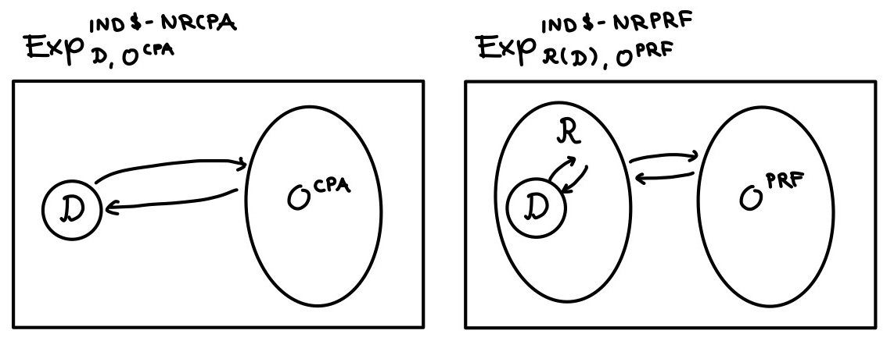

Proving Security
================

Having formalized the relevant context and the more general
security-related definitions (which, arguably, can also be considered
part of the context), we move on to the proof-specific aspects of the
formalization, culminating in the formal verification of the proof
itself.

High-Level Proof Sketch
-----------------------

Before diving into the details, we provide a high-level sketch or
intuition of the proof and its structure.

Foremost, recall that our aim is to show that our symmetric nonce-based
encryption scheme is IND$-NRCPA secure as long as the function family it
uses is a NRPRF. The predominant approach to proving such a statement
*reduces* the problem of breaking the NRPRF property of the function
family *to* the problem of breaking the IND$-NRCPA security of the
encryption scheme; proofs of this type are often referred to as
*reductionist proofs*. In our case, such a proof would essentially boil
down to defining, for every adversary :math:`\mathcal{D}` against the
IND$-NRCPA security of the encryption scheme, an adversary
:math:`\mathcal{R}^{\mathcal{D}}` against the NRPRF property of the
function family that “outperforms” :math:`\mathcal{D}` (i.e., the
advantage of :math:`\mathcal{R}^{\mathcal{D}}` is greater than or equal
to the advantage of :math:`\mathcal{D}`). Then, if there would exist any
adversary that is “unacceptably effective” at breaking the IND$-NRCPA
security of the encryption scheme, it immediately follows that there
also exists an adversary that is “unacceptably effective” in breaking
the NRPRF property of the employed function family. However, since it is
assumed (or “conjectured”) that a latter such adversary does not exist,
one can conclude that a former such adversary also does not exist and,
hence, that the encryption scheme is IND$-NRCPA secure.

As it turns out, EasyCrypt is specifically designed for the formal
verification of such reductionist proofs; for this reason, we stick to
this type of proof here. Particularly, we build a reduction adversary
(against the NRPRF property of
:math:`\left(f_{k} : \mathcal{N} \rightarrow \mathcal{P}\right)_{k \in \mathcal{K}}`)
that, given any (black-box) adversary against the IND$-NRCPA security of
:math:`\mathcal{E}`, simulates a regular run of the IND$-NRCPA
experiment in a way that allows the reduction adversary to win whenever
the given adversary “wins” the simulated run. A high-level illustration
of this dynamic is provided in the following image.

   alt text

Here, the left-hand side depicts a regular run of the IND$-NRCPA
experiment where the IND$-NRCPA adversary directly interacts with the
given NRCPA oracle; the right-hand side depicts a run of the NRPRF
experiment where the environment—particularly, oracle interactions—of
the IND$-NRCPA adversary is fully controlled by the reduction adversary,
who uses its NRPRF oracle to perfectly simulate the
environment—particularly, answers to oracle queries—in a way that
matches the environment of a regular run of the IND$-NRCPA experiment
and simultaneously allows making use of the eventual return value of the
given adversary.

Setup and Security Statements
-----------------------------

Prior to proving or formally verifying anything, we go over the
definition and formalization of the necessary proof-specific and
relevant security statements. Here, we take a top-down approach,
starting with the final goal and moving toward the lower-level steps.

The Main Result: IND$-NRCPA Security
~~~~~~~~~~~~~~~~~~~~~~~~~~~~~~~~~~~~

Once again, intuitively, the end goal is to demonstrate that
:math:`\mathcal{E}` is IND$-NRCPA secure based on the assumption that
:math:`\left(f_{k} : \mathcal{N} \rightarrow \mathcal{P}\right)_{k \in \mathcal{K}}`
is a NRPRF. More formally, the end goal is to prove the following
(pen-and-paper) theorem.

**Theorem 1.** *For all adversaries :math:`\mathcal{D}` against
IND$-NRCPA of :math:`\mathcal{E}`, there exists an adversary
:math:`\mathcal{B}` against NRPRF of
:math:`\left(f_{k} : \mathcal{N} \rightarrow \mathcal{P}\right)_{k \in \mathcal{K}}`
— with a running time close to that of :math:`\mathcal{D}` — such that
the following holds:*

.. math::

   \mathsf{Adv}^{\mathrm{IND\$\textrm{-}NRCPA}}_{\mathcal{E}}(\mathcal{D}) \leq \mathsf{Adv}^{\mathrm{NRPRF}}(\mathcal{B}) 

As alluded to before, we prove this theorem using a proof by
construction: Given any adversary :math:`\mathcal{D}` against IND$-NRCPA
security of :math:`\mathcal{E}`, we construct a reduction adversary
:math:`\mathcal{R}` against NRPRF of
:math:`\left(f_{k} : \mathcal{N} \rightarrow \mathcal{P}\right)_{k \in \mathcal{K}}`
— with a running time close to that of :math:`\mathcal{D}` — that
obtains an advantage that is *equal to* the advantage of the given
adversary. In fact, having defined such a reduction adversary, say
:math:`\mathcal{R}^{\mathcal{D}}`, the following theorem implies the one
above.

**Theorem 2.** *For all adversaries :math:`\mathcal{D}` against
IND$-NRCPA of :math:`\mathcal{E}`, the following holds.*

.. math::

   \mathsf{Adv}^{\mathrm{IND\$\textrm{-}NRCPA}}_{\mathcal{E}}(\mathcal{D}) = \mathsf{Adv}^{\mathrm{NRPRF}}(\mathcal{R}^{\mathcal{D}}) 

In EasyCrypt, there is no notion of running time; consequently, there is
also no way to formalize the restriction “with a running time close to
that of some algorithm”. For this reason, we typically formalize
theorems akin to **Theorem 2**, where the reasonableness of the
operations performed by the considered reduction adversary (i.e., in
terms of running time) is to be manually evaluated (by humans).

Before advancing to the formalization of **Theorem 2**, `recall that we
cannot formalize short-hands for the advantage expressions like we do on
paper <security#ind-nrcpa-experiment-and-security>`__; therefore, we
directly formalize the absolute difference in probabilities that these
advantages define. For convenience, the (pen-and-paper) definitions of
the relevant advantage expressions are restated below.

.. math::

   \mathsf{Adv}^{\mathrm{IND\$\textrm{-}NRCPA}}_{\mathcal{E}}(\mathcal{D}) 
   = \left|\mathsf{Pr}\left[\mathsf{Exp}^{\mathrm{IND\$\textrm{-}NRCPA}}_{\mathcal{D}, \mathcal{O}^{CPA\textrm{-}real}_{\mathcal{E}}} = 1\right]
   - \mathsf{Pr}\left[\mathsf{Exp}^{\mathrm{IND\$\textrm{-}NRCPA}}_{\mathcal{D}, \mathcal{O}^{CPA\textrm{-}ideal}} = 1\right]\right|  

.. math::

   \mathsf{Adv}^{\mathrm{NRPRF}}(\mathcal{R}^{\mathcal{D}})
   = \left|\mathsf{Pr}\left[\mathsf{Exp}^{\mathrm{NRPRF}}_{\mathcal{R}^{\mathcal{D}}, \mathcal{O}^{PRF\textrm{-}real}} = 1\right]
   - \mathsf{Pr}\left[\mathsf{Exp}^{\mathrm{NRPRF}}_{\mathcal{R}^{\mathcal{D}}, \mathcal{O}^{PRF\textrm{-}ideal}} = 1\right]\right| 

Here, `remember that these probability statements are only well-defined
if the initial memory/context are fixed and that, in EasyCrypt, we
explicitly indicate this initial
memory/context <security#ind-nrcpa-experiment-and-security>`__. Then, in
actuality, we want the above theorems to hold for any initial
memory/context. Apart from this explicit memory indication, the
formalization of `probability statements in
EasyCrypt </docs/reference#probability-statements>`__ closely follows
the pen-and-paper definitions. Essentially, given some specific initial
memory (variable) ``&m``, we can formalize the probability expressions
by replacing all algorithms by their formalized counterparts, appending
``@ &m`` (indicating that the execution starts in memory ``&m``),
writing a colon instead of an equality sign, and formalizing the
relevant event (where the special keyword ``res`` may be used to refer
to the output of the considered procedure). For example, for some
initial memory corresponding to ``&m``,

.. math:: \mathsf{Pr}\left[\mathsf{Exp}^{\mathrm{IND\$\textrm{-}NRCPA}}_{\mathcal{D}, \mathcal{O}^{CPA\textrm{-}real}_{\mathcal{E}}} = 1 \right]

is formalized as
``Pr[Exp_IND_NRCPA(O_NRCPA_real(E), D).run() @ &m : res]``. (Here, since
the output of ``Exp_IND_NRCPA(O_NRCPA_real(E), D).run()``—and, hence,
``res``—is a boolean, ``res`` is equivalent to ``res = true``.)

Finally, theorems/lemmas are formalized `similarly to
axioms <context#axioms>`__, merely replacing the ``axiom`` keyword by
the ``lemma`` keyword. [1]_ Combining everything, we can formalize
**Theorem 2** as follows.

::

   lemma EqAdvantage_IND_NRCPA_NRPRF &m:
     `| Pr[Exp_IND_NRCPA(O_NRCPA_real(E), D).run() @ &m: res]
        - Pr[Exp_IND_NRCPA(O_NRCPA_ideal, D).run() @ &m: res] |
     = 
     `| Pr[Exp_NRPRF(O_NRPRF_real, R_NRPRF_IND_NRCPA(D)).run() @ &m: res]
        - Pr[Exp_NRPRF(O_NRPRF_ideal, R_NRPRF_IND_NRCPA(D)).run() @ &m: res] |.

In this lemma, ``D`` denotes the formalization of :math:`\mathcal{D}`
(i.e., an arbitrary IND$-NRCPA adversary); where and how we declare this
arbitrary/abstract module will be discussed in one of the upcoming
sections on the formal verification of the statements. Furthermore,
``R_NRPRF_IND_NRCPA(D)`` denotes the formalization of
:math:`\mathcal{R}^{\mathcal{D}}`, which we discuss imminently.

Reduction Adversary
~~~~~~~~~~~~~~~~~~~

The main proof-specific artifact we must formalize is the reduction
adversary. This reduction adversary is given an IND$-NRCPA adversary but
is a NRPRF adversary itself, meaning it also gains access to a NRPRF
oracle. As touched upon in `the high-level proof
sketch <proof#high-level-proof-sketch>`__, the crux of the argument is
that the reduction adversary perfectly simulates a run of the IND$-NRCPA
experiment for the given adversary using the NRPRF oracle in a way that
allows for the reduction adversary to win the NRPRF experiment whenever
the given adversary would have won the simulated IND$-NRCPA experiment.
Somewhat more precisely, the reduction adversary executes the given
adversary while simulating the NRCPA oracle by encrypting each of the
queried plaintexts using the values returned from the NRPRF oracle (when
querying it on the same plaintexts). If done properly, the view of the
given adversary is (distributed) exactly the same as the view it would
have in a regular run of its own experiment. Consequently, the behavior
of the given adversary—and, hence, (the distribution of) its
output—matches the behavior it would exhibit in a regular run of its own
experiment. Furthermore, since the encryptions returned to the given
adversary were constructed using the NRPRF oracle, the reduction
adversary can directly translate a correct (or incorrect) choice by the
given adversary regarding the validity of the provided encryptions into
a correct (or incorrect) choice regarding the validity of the values
provided by the NRPRF oracle. As such, the reduction adversary will
invariably be correct (and incorrect) with the exact same probability as
the given adversary, *independent of the actual implementation of the
given adversary*.

Because the reduction adversary itself is a NRPRF adversary, we
formalize it as a module of type ``Adv_NRPRF``. To indicate that the
module formalizes the ``R``\ eduction adversary that reduces from
``NRPRF`` to ``IND_NRCPA``, we name the module ``R_NRPRF_IND_NRCPA``.
However, because a module of type ``Adv_NRPRF`` *only* expects a module
of type ``NRPRF_Oracle`` as parameter, the module parameter of type
``Adv_IND_NRCPA`` (formalizing the given IND$-NRCPA adversary) must come
first. Indeed, loosely speaking, a module is of type ``Adv_NRPRF`` *only
if* it still expects a single module parameter of type ``NRPRF_Oracle``;
if there are any other module parameters, these must first be
instantiated before the module “becomes” of type ``Adv_NRPRF``. This is
reflected in the (module) type annotations of the module definition,
provided in the snippet below.

::

   module (R_NRPRF_IND_NRCPA (D : Adv_IND_NRCPA) : Adv_NRPRF) (O_NRPRF : NRPRF_Oracle) = {
     module O_NRCPA : NRCPA_Oracle = {
       proc enc(n : nonce, m : ptxt) : ctxt option = {
         var p : ptxt option;
         var r : ctxt option;

         p <@ O_NRPRF.get(n);
         
         r <- if p = None then None else Some (oget p + m);
         
         return r;
       }
     }

     proc distinguish() : bool = {
       var b : bool;

       b <@ D(O_NRCPA).distinguish();
       
       return b;
     }
   }.

Here, we see that the reduction adversary defines a *sub-module*
``O_NRCPA`` of type ``NRCPA_Oracle``; as the type enforces, this
sub-module implements an ``enc`` procedure. In this ``enc`` procedure,
the reduction adversary directly queries the provided NRPRF oracle
module (``O_NRPRF``) on ``n``. Subsequently, if the value ``p`` returned
by the NRPRF oracle is a failure indication, then the reduction
adversary returns a failure indication as well; else, if the value ``p``
returned by the NRPRF oracle contains a valid plaintext, the reduction
adversary returns the ciphertext obtained by mapping this plaintext and
``m`` using the ``+`` operator. (Indeed, the ``oget`` operator takes a
value of any option type and, if the value equals ``Some x``, it returns
``x``; else, it returns an arbitrary value of the original type.)

In its ``distinguish`` procedure, the reduction adversary uses its
sub-module as the NRCPA oracle that is exposed to the given adversary.
This formalizes the simulation of oracle interactions by the reduction
adversary for the given adversary. In the end, the reduction adversary
simply returns the value returned by the given adversary.

Intermediate Results: Equal Probabilities in Real and Ideal Cases
~~~~~~~~~~~~~~~~~~~~~~~~~~~~~~~~~~~~~~~~~~~~~~~~~~~~~~~~~~~~~~~~~

To separate concerns, we break the main part of the proof down into two
independent pieces: equality of the “real case” probabilities and
equality of the “ideal case” probabilities. More formally, we proceed by
separately proving the following two equalities.

.. math::

   \mathsf{Pr}\left[\mathsf{Exp}^{\mathrm{IND\$\textrm{-}NRCPA}}_{\mathcal{D}, \mathcal{O}^{CPA\textrm{-}real}_{\mathcal{E}}} = 1\right]
   = \mathsf{Pr}\left[\mathsf{Exp}^{\mathrm{NRPRF}}_{\mathcal{R}^{\mathcal{D}}, \mathcal{O}^{PRF\textrm{-}real}} = 1\right]

.. math::

   \mathsf{Pr}\left[\mathsf{Exp}^{\mathrm{IND\$\textrm{-}NRCPA}}_{\mathcal{D}, \mathcal{O}^{CPA\textrm{-}ideal}} = 1\right]
   = \mathsf{Pr}\left[\mathsf{Exp}^{\mathrm{NRPRF}}_{\mathcal{R}^{\mathcal{D}}, \mathcal{O}^{PRF\textrm{-}ideal}} = 1\right]

At this point, it might be good to note (and convince yourself) that the
defined reduction adversary indeed does what we want in both of the
considered cases (“real” and “ideal”); in particular, it properly
simulates the NRCPA oracle in either case. If the provided NRPRF oracle
module is the real one (``O_NRPRF_real``), then ``get(n)`` returns a
failure indication if ``n`` was already queried, and a plaintext
obtained by applying the function ``f`` to ``k`` and ``n`` otherwise. In
the former case, the reduction adversary returns a failure indication as
well. In the latter case, the reduction adversary returns a ciphertext
constructed by mapping the received plaintext and ``m`` using ``+``.
Certainly, that is equivalent to the real NRCPA oracle module
``O_NRPRF_real`` using the encryption scheme ``NBEncScheme`` to obtain
the same ciphertext given that the input and the key are the same.
Meaning that the reduction adversary perfectly simulates the real NRCPA
oracle module (O_NRCPA_real) when it is given the real NRPRF oracle
module (O_NRPRF_real). When providing the ideal oracle ``O_NRCPA_ideal``
to the reduction adversary the intresting case is again, when the nonce
was not queried before and the ``get(n)`` procedure returns a randomly
(uniformly) sampled plaintext. Again the reduction adversary returns a
ciphertext constructed by mapping the received plaintext and ``m`` using
``+``. Since the received plaintext is uniformly distributed, it
essentially functions as a one-time pad in this mapping; hence, the
resulting ciphertext is uniformly distributed as well. Following, even
though the ideal NRCPA oracle module (``O_NRCPA_ideal``) does not
perform this mapping (but instead directly samples a ciphertext
uniformly at random and returns this), the distribution of the returned
ciphertext is identical. As a result, the reduction adversary simulates
the ideal case perfectly.

The veracity of these equalities almost immediately follows from the
previous discussion concerning the reduction adversary. That is, in
either case, :math:`\mathcal{R}^{\mathcal{D}}` perfectly simulates the
corresponding case for :math:`\mathcal{D}`, meaning (the distribution
of) the output of :math:`\mathcal{D}` is identical to what it would be
in a run of its own game. Then, since :math:`\mathcal{R}^{\mathcal{D}}`
directly returns the value returned by :math:`\mathcal{D}`, the
probability of this value being 1 is trivially equal to the probability
of the value returned by :math:`\mathcal{D}` being 1 in a run of its own
game.

In EasyCrypt, the equality of the “real case” probabilites is formalized
as the lemma shown in the snippet below.

::

   lemma EqPr_IND_NRCPA_NRPRF_real &m:
     Pr[Exp_IND_NRCPA(O_NRCPA_real(E), D).run() @ &m : res]
     = 
     Pr[Exp_NRPRF(O_NRPRF_real, R_NRPRF_IND_NRCPA(D)).run() @ &m : res].

Similarly, the equality of the “ideal case” probabilites is formalized
as follows.

::

   lemma EqPr_IND_NRCPA_NRPRF_ideal &m:
     Pr[Exp_IND_NRCPA(O_NRCPA_ideal, D).run() @ &m: res]
     = 
     Pr[Exp_NRPRF(O_NRPRF_ideal, R_NRPRF_IND_NRCPA(D)).run() @ &m: res].

Following `the previous discussion about lemmas in
EasyCrypt <proof#the-main-result-ind-nrcpa-security>`__, these
formalizations should be relatively easy to interpret and understand.
Nevertheless, some more details including the declaration of the
arbitrary/abstract module ``D``, will be covered
`momentarily <proof#sections>`__.

Formal Verification
-------------------

At last, we advance to the formal verification of the security
statements. That is, in the remainder, we go over the process of proving
the previously formalized lemmas in EasyCrypt. As before, we take a
top-down approach to the discussion, starting with the formal
verification of the main result (temporarily assuming the veracity of
the intermediate result) and only then proceeding to the formal
verfication of the intermediate lemmas. Nevertheless, before anything,
we introduce the concept of sections in Easycrypt, elucidating several
aspects that we skimmed over previously (e.g., the declaration of an
arbitrary/abstract module and the ``local`` keyword).

Sections
~~~~~~~~

Oftentimes, instead of formally verifying the main result(s) at once, it
is more convenient and more manageable (both for the prover and the
reader) to first formally verify some useful auxiliary results, and then
combining these to formally verify the main result(s). These auxiliary
results are generally quite proof-specific, so much so that you wouldn’t
really want them (or any related auxiliary artifacts) to be
saved/exposed after you have used them for their specific purpose.
Furthermore, these auxiliary results frequently pertain to/quantify over
the same artifacts as the eventual main result(s) (e.g., an adversary);
it is cumbersome to repeat the precise declaration/quantification of
these artifacts over and over for each individual result.

A useful and convenient feature of EasyCrypt that alleviates the above
issues is the (proof) section environment; this environment is delimited
by the sentences ``section X.`` and ``end section X.`` (where ``X`` is
an optional name for the section). Inside of a section, we can “declare”
modules with the desired restrictions using the ``declare`` keyword.
Afterward, we can refer to these declared modules throughout the entire
remainder of the section; without this feature, we would need to
declare/quantify these modules (and the restrictions) anew everywhere we
need to use them. In our case, all our results (both intermediate and
final) quantify over IND$-NRCPA adversaries. As such, in the beginning
of our section, we ``declare`` a module ``D`` of type ``Adv_IND_NRCPA``
with the appropriate restrictions; see the following snippet.

::

   section E_IND_NR_CPA.

   declare module D <: Adv_IND_NRCPA { -O_NRCPA_real, -O_NRCPA_ideal, -O_NRPRF_real, -O_NRPRF_ideal }.

   (* Can use D anywhere here *)

   end section E_IND_NR_CPA.

By default, any module in EasyCrypt has access to the module variables
of other modules (as well as its own, of course). This also holds for
modules that are declared in sections. However, we do not want
adversaries to have access to the state of the oracles used in the
experiments. (In pen-and-paper proofs, this is also always a given.) To
specify the modules of which a declared module may not access the
variables, we provide a a comma-separated list of the names of these
exempted modules (preceded by a ``-``) in between curly brackets
following the type annotation.

In addition to declaring modules, a section allows us to mark
definitions of types, operators, module types, modules and lemmas as
local (using the ``local`` keyword) such that they are only accessible
inside the section (i.e., they are not exposed outside the section). As
we see
`later <proof#intermediate-result-1-equal-probabilities-in-real-case>`__,
we mark our two intermediate lemmas as ``local``; this is because these
lemmas are proof-specific auxiliary results used to make the formal
verification of the main result more manageable. Contrarily, the lemma
for the main result is not marked as ``local`` since it is the primary
result that we would like to be available outside the section.
Nevertheless, this lemma still refers to ``D``, the module declared
inside of the section (and that is not exposed outside of the section).
As a result, after closing the section, the lemma for the main result
will be extended with the appropriate quantification over modules of
type ``Adv_IND_NRCPA`` (including the desired restrictions).

.. _the-main-result-ind-nrcpa-security-1:

The Main Result: IND$-NRCPA Security
~~~~~~~~~~~~~~~~~~~~~~~~~~~~~~~~~~~~

At this point, we really have everything in place to start formally
verifying our security statements. Following a top-down approach to the
discussion, we start with the formal verification of the main result. To
this end, assume (for now) that we have already formally verified the
intermediate results and, hence, have them at our disposal in the formal
verification of the main result.

Everytime we write down a lemma statement, we are expected to prove
(“formally verify”) the statement immediately. In fact, the tool will
not continue processing any further commands until a full proof is
provided. Once the proof is complete, the lemma is saved and is
available for us to use in any subsequent proofs. To start proving a
lemma, we write the sentence ``proof.``; to save a lemma after proving
it, we write the sentence ``qed.``. Considering the lemma for our main
result, this looks as follows.

::

   lemma EqAdvantage_IND_NRCPA_NRPRF &m:
     `| Pr[Exp_IND_NRCPA(O_NRCPA_real(E), D).run() @ &m: res]
        - Pr[Exp_IND_NRCPA(O_NRCPA_ideal, D).run() @ &m: res] |
     = 
     `| Pr[Exp_NRPRF(O_NRPRF_real, R_NRPRF_IND_NRCPA(D)).run() @ &m: res]
        - Pr[Exp_NRPRF(O_NRPRF_ideal, R_NRPRF_IND_NRCPA(D)).run() @ &m: res] |.
   proof.
   (* Proof *)
   qed.

Between ``proof.`` and ``qed.``, we provide the actual proof of the
considered statement.

Throughout any proof in EasyCrypt, the tool maintains a so-called *proof
state*, a sequence of one or more *proof goals*. Each proof goal
consists of a *context* and a *conclusion*: the context contains all
locally (i.e., goal-specific) considered variables and properties
(“hypotheses”); the conclusion is a boolean expression that is to be
shown to evaluate to true. Initially, for any proof, the proof state
consist only of a single proof goal: the one corresponding to the
original lemma statement. As a proof progresses, already existing goals
change and new goals may appear. Whenever a goal’s conclusion is shown
to be true, the goal is “closed” (i.e., removed from the proof state);
after closing all goals, the proof is complete and the original lemma
may be saved.

In interactive mode (which is practically required for developing),
EasyCrypt can display the proof state and update it as the proof
progresses. By default, only the currently considered proof goal of the
proof state (i.e., the first goal in the sequence of goals in the state)
is displayed. For example, the following is what is initially displayed
for our main result (which can be reached by processing up to and
including ``proof.``).

::

   Current goal

   Type variables: <none>

   &m: {}
   ----------------------------------------------------------------------------------------------
   `|Pr[Exp_IND_NRCPA(O_NRCPA_real(E), D).run() @ &m : res] 
     - Pr[Exp_IND_NRCPA(O_NRCPA_ideal, D).run() @ &m : res]| 
   =
   `|Pr[Exp_NRPRF(O_NRPRF_real, R_NRPRF_IND_NRCPA(D)).run() @ &m : res] 
     - Pr[Exp_NRPRF(O_NRPRF_ideal, R_NRPRF_IND_NRCPA(D)).run() @ &m : res]|

Here, everything above the dotted line is part of the goal’s context,
and everything below the dotted line is part of the goal’s conclusion.
In an initial proof goal like this one, the context always only contains
the (type) variables declared between the lemma’s name and the lemma’s
statement; indeed, in this case, this is only the memory variable
``&m``. Furthermore, the conclusion of such an initial goal always
equals the lemma’s statement.

To go from opening the initial proof goal to closing the final proof
goal and saving the lemma, we repeatedly apply *tactics*. In essence, a
tactic represents a reasoning principle that may be applied to make
progress in a proof. EasyCrypt provides many tactics, covering a wide
range of scenarios; we will introduce and elaborate on the ones we use
in this tutorial as we go. For a comprehensive overview of the tactics
and their individual variations, consult the reference manual.

Assuming we have access to the intermediate results (i.e., lemmas
``EqPr_IND_NRCPA_NRPRF_real`` and ``EqPr_IND_NRCPA_NRPRF_ideal``),
proving the above goal is rather straightforward: we can simply use that
the left-hand side minuend and subtrahend are respectively equal to
their right-hand side counterparts. To do so, we make use of the
``rewrite`` tactic. Given the name of a lemma/axiom that defines an
equality (say ``X = Y``), this tactic searches the current goal’s
conclusion for ``X`` and replaces it with ``Y``. Thus, in our case,
issuing ``rewrite EqPr_IND_NRCPA_NRPRF_real.`` should replace
``Pr[Exp_IND_NRCPA(O_NRCPA_real(E), D).run() @ &m : res]`` with
``Pr[Exp_NRPRF(O_NRPRF_real, R_NRPRF_IND_NRCPA(D)).run() @ &m : res]``.
Certainly, doing so changes the proof goal to the following.

::

   Current goal

   Type variables: <none>

   &m: {}
   ----------------------------------------------------------------------------------------------
   `|Pr[Exp_NRPRF(O_NRPRF_real, R_NRPRF_IND_NRCPA(D)).run() @ &m : res] 
     - Pr[Exp_IND_NRCPA(O_NRCPA_ideal, D).run() @ &m : res]| 
   =
   `|Pr[Exp_NRPRF(O_NRPRF_real, R_NRPRF_IND_NRCPA(D)).run() @ &m : res] 
     - Pr[Exp_NRPRF(O_NRPRF_ideal, R_NRPRF_IND_NRCPA(D)).run() @ &m : res]|

Subsequently issuing ``rewrite EqPr_IND_NRCPA_NRPRF_real.`` results in
the proof goal below.

::

   Current goal

   Type variables: <none>

   &m: {}
   ----------------------------------------------------------------------------------------------
   `|Pr[Exp_NRPRF(O_NRPRF_real, R_NRPRF_IND_NRCPA(D)).run() @ &m : res] 
     - Pr[Exp_NRPRF(O_NRPRF_ideal, R_NRPRF_IND_NRCPA(D)).run() @ &m : res]| 
   =
   `|Pr[Exp_NRPRF(O_NRPRF_real, R_NRPRF_IND_NRCPA(D)).run() @ &m : res] 
     - Pr[Exp_NRPRF(O_NRPRF_ideal, R_NRPRF_IND_NRCPA(D)).run() @ &m : res]|

Obviously, this goal’s conclusion is true: the right-hand side and
left-hand side are literally the same. For these kind of trivial goals,
we can use the ``trivial`` tactic to try and close the goal. Indeed,
issuing ``trivial.`` closes the goal and, since this was the only proof
goal left in the proof state, completes the proof. Everything combined,
we obtain the following for our main result.

::

   lemma EqAdvantage_INDNRCPA_NRPRF &m:
     `|Pr[Exp_IND_NRCPA(O_NRCPA_real(E), D).run() @ &m: res]
       - Pr[Exp_IND_NRCPA(O_NRCPA_ideal, D).run() @ &m: res]|
     = 
     `|Pr[Exp_NRPRF(O_NRPRF_real, R_NRPRF_INDNRCPA(D)).run() @ &m: res]
       - Pr[Exp_NRPRF(O_NRPRF_ideal, R_NRPRF_INDNRCPA(D)).run() @ &m: res]|.
   proof. 
   rewrite EqPr_INDNRCPA_NRPRF_real.
   rewrite EqPr_INDNRCPA_NRPRF_ideal.
   trivial.
   qed.

To make this proof a bit cleaner, we can make use of the *tactical*
``by`` and a particular feature of the ``rewrite`` tactic. First, a
tactical combines or modifies (a sequence of) tactics in some way. In
the case of ``by``, it executes the tactic(s) directly following it and
then attempts to close the resulting goal(s) using ``trivial``. If the
goal(s) cannot be closed after applying ``trivial``, ``by`` will throw
an error. Second, rewrite can be given multiple lemma/axiom names. For
example, issuing ``rewrite Lemma1 Lemma2.``, the tactic will first
rewrite the current goal’s conclusion according to ``Lemma1``, and then
rewrite according to ``Lemma2`` in the conclusion of the goal(s)
generated by the rewriting of ``Lemma1``. Employing these features, we
can reduce the proof to the following one-liner.

::

   proof. 
   by rewrite EqPr_INDNRCPA_NRPRF_real EqPr_INDNRCPA_NRPRF_ideal.
   qed.

Intermediate Result 1: Equal Probabilities in Real Case
~~~~~~~~~~~~~~~~~~~~~~~~~~~~~~~~~~~~~~~~~~~~~~~~~~~~~~~

*We strongly recommend you follow the explanation in this section while
stepping through the code yourself (in interactive mode)*

In the formal verification of the main result, we assumed that we had
already formally verified the intermediate results. Now, we actually go
over the formal verification of these intermediate results, starting
with the one concerning the equality of the “real case” probabilities.
The following snippet the corresponding lemma together with a complete
proof in EasyCrypt. Note that we declare the lemma using the keyword
``local`` as discussed `before <proof#sections>`__.

::

   local lemma EqPr_IND_NRCPA_NRPRF_real &m:
     Pr[Exp_IND_NRCPA(O_NRCPA_real(E), D).run() @ &m : res]
     = 
     Pr[Exp_NRPRF(O_NRPRF_real, R_NRPRF_IND_NRCPA(D)).run() @ &m : res].
   proof.
   byequiv (_ : ={glob D} ==> ={res}); trivial.
   proc.
   inline *.
   sim (_ : ={k}(O_NRCPA_real, O_NRPRF_real) /\ ={log}(O_NRCPA_real, O_NRPRF_real)).
   proc.
   inline *.
   auto.
   qed.

The initial sentence of the proof consists of two tactics, ``byequiv``
and ``trivial``, combined through the tactical ``;``. Combining two
tactics by means of ``;``, as in ``t1; t2.``, first applies tactic
``t1`` to the current goal, and then applies tactic ``t2`` to the
goal(s) generated by the application of ``t1``. In our case, we combine
``byequiv`` and ``trivial`` to immediately close some of the trivial
goals generated by the application of ``byequiv``. The ``byequiv``
tactic is more interesting. Namely, this tactic allows us to prove
certain (in)equalities of probabilities concerning program executions by
demonstrating a particular *equivalence* between the considered
programs. This equivalence of programs is always with respect to a
certain pre and postcondition, which are specified in the argument
provided to ``byequiv``; the format of this argument is
``(_ : pre ==> post)``, where ``pre`` and ``post`` respectively denote
the pre and postcondition. In our case, the precondition is
``={glob D}`` (which is syntactic sugar for
``(glob D){1} = (glob D){2}``), [2]_ i.e., we require the accessible
module variables (read: environment/view) of module ``D`` to start out
the same in both executions; the postcondition is ``={res}``, i.e., we
require the output of the programs to be (distributed) the same.
Processing this intial sentence results in a goal that precisely
corresponds to the program equivalence with this pre and postcondition.

In the second sentence of the proof, we apply the ``proc`` tactic; this
tactic can be used on goals with a conclusion corresponding to a program
logic statement on procedure identifiers (i.e., not on actual code). The
program logics of EasyCrypt are Hoare Logic (HL), probabilistic Hoare
Logic (pHL), and probabilistic Relation Hoare Logic (pRHL). The current
goal’s conclusion denotes a pRHL statement with identifiers of
*concrete* procedures; in such a case, ``proc`` simply replaces the
identifiers by the code of the procedures.

After applying ``proc``, we see that the code of the procedures contains
several calls to various concrete procedures. To get a better view of
what actually happens, we inline all of these concrete procedure calls
by applying the ``inline`` tactic. In particular, since we want to
inline *all* concrete procedure calls, we apply ``inline *``. (If we
wanted to inline only a particular concrete procedure call, say
``O_NRCPA_real(E).init``, we could’ve used
``inline O_NRCPA_real(E).init``.)

Looking at the programs in the goal, we notice that they are really
quite similar. Essentially, ignoring auxiliary assignments, the only
difference is the oracle that is provided to the adversary ``D`` when
calling its (abstract) ``distinguish`` procedure. By construction, we
know that these oracles should behave identically *provided* that they
have the same keys and logs throughout the execution. For cases like
this, EasyCrypt provides the convenient higher-level ``sim`` tactic.
Reasoning backward from the end of the programs, this tactic attempts to
prove a program equivalence by keeping track of (and
extending/adjusting) a conjunction of equalities that implies the
original postcondition; if the tactic manages to work through both
programs completely, it tries to show that the original precondition
implies the final conjunction of equalities, which proves the original
equivalence. Indeed, for the current goal, it suffices to maintain the
fact that ``k`` and ``log`` of ``O_NRCPA_real`` and ``O_NRPRF_real`` are
equal throughout the execution of the programs to guarantee that the
oracles provided to ``D`` behave identically and, hence, that ``D``
outputs the same value (distribution) in both programs as well. Although
``sim`` can be used without any arguments to let EasyCrypt infer the
invariant from the postcondition, this is not sufficient in the current
case; therefore, we provide the invariant explicitly as
``(_ : ={k}(O_NRCPA_real, O_NRPRF_real) /\ ={log}(O_NRCPA_real, O_NRPRF_real))``,
where ``={x}(M, N)`` is syntactic sugar for ``M.x{1} = N.x{2}``.
Applying the ``sim`` tactic with this invariant leaves us with a
*single* goal asking us to prove an equivalence of the ``enc``
procedures of the oracles provided to ``D``; specifically, the goal asks
us to prove that, whenever the inputs to the oracles are the same *and*
the above invariant holds, the outputs of the oracles are (distributed)
the same *and* the invariant still holds. This shows that the
application of ``sim`` managed to close the original goal *under the
assumption that* the oracles behave identically and maintain the
invariant when called. Now, we are expected to still prove this
assumption to complete the proof.

Once again, the current goal concerns a pRHL equivalence on concrete
procedure identifiers; so, we apply ``proc``. Then, since the resulting
code contains several calls to concrete procedure, we inline all of them
by applying ``inline *``. Considering the definition of the ``omap``
operator, the programs are almost trivially seen to be semantically
identical. Furthermore, the code merely contains assignment statements
and if-then-else constructs. As such, this goal is a good target for
another relatively high-level tactic called ``auto``. This tactic
applies a sequence of several basic program logic tactics, afterward
solving the goal if it is trivial. In this case, ``auto`` manages to
solve the goal and, thereby, complete the proof.

Intermediate Result 2: Equal Probabilities in Ideal Case
~~~~~~~~~~~~~~~~~~~~~~~~~~~~~~~~~~~~~~~~~~~~~~~~~~~~~~~~

*We strongly recommend you follow the explanation in this section while
stepping through the code yourself (in interactive mode)*

Bringing everything to a close, we discuss the formal verification of
the second intermediate result: the equality of the “ideal case”
probabilities. Here, we focus on novel (uses of) tactics that did not
occur in the previous formal verifications. The following snippet
presents the corresponding lemma along with a full proof in EasyCrypt.
Again we use the keyword ``local`` as discussed
`before <proof#sections>`__.

::

   local lemma EqPr_INDNRCPA_NRPRF_ideal &m:
     Pr[Exp_IND_NRCPA(O_NRCPA_ideal, D).run() @ &m: res]
     = 
     Pr[Exp_NRPRF(O_NRPRF_ideal, R_NRPRF_INDNRCPA(D)).run() @ &m: res].
   proof.
   byequiv (_ : ={glob D} ==> ={res}) => //.
   proc; inline *.
   wp.
   call (_ : ={log}(O_NRCPA_ideal, O_NRPRF_ideal)).
   - proc; inline *.
     sp.
     if => //.
     - wp.
       rnd (fun (p : ptxt) => p + m{2}).
       wp.
       skip => />.
       move => &2 _.
       split.
       - move => y _.
         rewrite addpK //.
       move => _ c _.
       rewrite addpK //.
     auto.  
   auto.
   qed.

As in the formal verification of the first equality of probabilities, we
start off with an application of the ``byequiv`` tactic with equality on
the initial environment of ``D`` and (distribution of the) outputs as
pre and postcondition, respectively. However, instead of combining this
with the ``trivial`` tactic by means of ``;``, we append the
semantically equivalent, but slightly cleaner, ``=> //``. In EasyCrypt,
the ``=>`` can be tacked onto any (sequence of) tactic(s) to start a
sequence of so-called “introduction patterns”. In order, each of the
introduction patterns in the sequence is applied to the goal(s)
generated by the preceding (sequence of) tactic(s) and introduction
pattern(s). An important application of introduction patterns is the
*introduction* of universally quantified variables and hypothesis *from*
a goal’s conclusion *to* a goal’s context. For example, if a goal’s
conclusion starts with ``forall (i : int), ...``, the introduction
pattern ``=> j`` will remove the quantification from the goal’s
conclusion and add ``j: int`` to the goal’s context (note that the
introduced variable’s identifier does not need to match the auxiliary
identifier in the quantification). Similarly, if a goal’s conclusion
starts with, e.g., ``x <> y => ...``, then the introduction pattern
``=> H`` will remove the ``x <> y`` antecedent (and the corresponding
implication arrow) from the goal’s conclusion and add ``H: x <> y`` to
the goal’s context. In the remainder of the proof for that goal, ``H``
is available as if it were a regular axiom/lemma.

After applying ``byequiv``, we obtain a single goal denoting a pRHL
equivalence on procedure identifiers, as desired. We replace the
procedure identifiers with the code of the procedures and immediately
inline all calls to concrete procedures in the resulting programs by
applying ``proc; inline *``. This leaves us with two programs that are
nearly identical, only differing in the oracle provided to ``D`` and an
auxiliary assignment. Now, the right-hand side program ends in a simple
assignment; we would like to get rid of this statement so that we can
reason about and relate the abstract procedure calls on both sides
(which requires these calls to be the very last statement in both
programs). To do so, we apply the “weakest precondition” tactic, ``wp``.
In essence, this tactic consumes assignment statements from the end of
the programs while adapting the postcondition in a way that reflects the
execution of these statements; the pRHL equivalence that results from
this implies the original one.

At this point, both programs end with a call to the same abstract
procedure, i.e., ``distinguish`` of ``D``; however, the exposed oracles
differ and the equivalence between them cannot be proven using the
``sim`` tactic. So, the main points we want to argue is that (1) the
adversary starts out with the same view/environment on both sides, and
(2) even though the provided oracles differ, their behavior is
identical. In turn, the adversary’s view—and, hence, its behavior—is the
same on both sides throughout its execution; particularly, this means
that the adversary’s output (distribution) is the same on both sides.
For this kind of reasoning, we use the ``call`` tactic in EasyCrypt.
This tactic removes the abstract procedure calls and allows us to claim
that the returned value is equally distributed on both sides. However,
to make sure this is sound, it produces two goals that formally
encompass the two previously mentioned conditions. One asks us to prove
that, right before the procedure calls are made, the environment of the
considered module (i.e., ``glob D`` in this case) is equal on both
sides; the other asks us to prove a pRHL equivalence essentially
capturing that, given the same input, the exposed oracles produce the
same output (distribution) on both sides. To assist in (or even make
possible at all) proving the latter, the ``call`` tactic takes an
invariant (as ``(_ : invariant)``) that is maintained throughout the
oracle calls. Naturally, the fact that this invariant holds at the start
*and* is maintained throughout becomes part of the goals. Indeed, all we
need as an invariant in this case is equality of the logs
(``={log}(O_NRCPA_ideal, O_NRPRF_ideal)``), guaranteeing that the
exposed oracles are synchronized with respect to failure indication.

In the interest of keeping our code somewhat clean and readable (to
those who can understand EasyCrypt code in the first place), we indent
our proof code whenever the previous tactic application more than one
goal, hence resulting in a proof state with more goals than before the
application. (Similarly, we unindent whenever the previous tactic
application closed a goal.) In our case, since the application of
``call`` resulted in the generation of two goals, we indent the next
sentence of proof code by starting it with the indentation symbol ``-``
and a single whitespace. This sentence will apply to the first goal
generated by ``call``, and we indent all subsequent sentences applying
to this first goal by two whitespaces. After closing this goal and
arriving at the last goal generated by ``call``, we return to the same
indentation level we used for the ``call`` tactic itself. Of course, we
use this styling rule recursively; for example, if, during the proof of
the first goal, we were to apply a tactic that again generated more than
one goal, we indent another level in the same manner as before.

The first goal generated by the ``call`` tactic concerns the behavioral
equivalence of the exposed oracles. As per usual, we apply ``proc`` and
``inline *`` to first change this pRHL equivalence on procedure
identifiers to one on the code of the procedures, and subsequently
inlining all concrete procedure calls in this code. This leaves us with
two programs for which we want to show, among others, that their output
value (``r``) is (distributed) the same, as indicated by the ``={r}``
term in the postcondition. Inspecting the programs (and keeping the
precondition in mind), we foremost note that the same branch of the
if-statement will be executed on both sides due to the inputs and logs
being equal. Now, if the else-branch is taken, the equality of (the
distribution of) ``r`` trivially holds; namely, ``r`` will simply be
``None`` on both sides (recall that ``omap`` outputs None if its second
argument is ``None``). However, if the then-branch is taken, the
(distributions of the) return values are not trivially identical: On the
left-hand side, the return value is the value sampled in the
then-branch; on the right-hand side, the return value is the value
obtained from mapping the value sampled in the then-branch (with the
input plaintext) using ``+``. Surely, since the sampled value
essentially functions as a one-time pad in this mapping, the
distribution of the return values is still the same on both sides;
nevertheless, this is not trivial (at least not for the tool) and,
therefore, we will need to do some more work than simply applying some
of the higher-level automated tactics.

Following from the above, one approach to proving the current goal is
showing that (1) both sides invariably execute the same branch of the
if-statement, and (2) the equivalence holds independent of the executed
branch. Fortunately, the ``if`` tactic enables us to take this exact
approach. However, this tactic is only applicable when the if-statements
are the first statement in both programs. So, to achieve this, we need
to get rid of the assignment statement preceding the if-statement in the
right-hand side program. In turn, we achieve this by means of the
“strongest precondition” tactic, ``sp``, which is basically the dual of
``wp``. As you might have guesses, ``sp`` consumes assignment statements
from the beginning of both programs while accordingly adapting the
precondition. After applying ``sp``, we apply ``if``, and immediately
close one of the trivial goals it generates by appending ``=> //``.
Specifically, this trivial goal concerns the equivalence of the
if-guards on both sides, i.e., the fact that both sides invariably enter
the same branch; this is a trivial goal in this case because the
equality of the variables stated in the precondition makes the guards
exactly the same. Of course, the other goals generated by the ``if``
tactic concern the veracity of the pRHL equivalence when executing the
different branches.

Since the application of ``if => //`` generated more than one goal, we
indent the code another level, as before. The current goal is the first
goal generated by ``if => //`` and regards the equivalence of the
programs when executing the then-branch of the if-statement. Starting
off, we apply ``wp`` to consume the assignment statements at the end of
the programs; this results in both of the programs ending with a
sampling from the same distribution (recall that ``dctxt`` and ``dptxt``
refer to the same *uniform* distribution over all
plaintexts/ciphertexts) that we want to relate somehow. Now, whenever we
want to relate samplings, we use the ``rnd`` tactic. [3]_ Oftentimes, we
use this tactic without any arguments, which essentially assumes that
the *same* value is sampled on both sides. However, sometimes, we want
to say that whenever we sample a certain value on the left-hand side, we
sample a uniquely-linked value on the right-hand side. Surely, as long
as all of the linked values have the same probability of being sampled
on each side, this is sound. For such cases, the ``rnd`` tactic takes
two more arguments that, together, form a bijection between the supports
of the considered distributions. Indeed, this bijection is what
establishes the unique link between the values from the distributions;
of course, you must then still prove that the probability of each of the
linked values in their respective distribution is identical. As some
nice syntactic sugar, whenever the bijection consists of the same
function twice, you only have to provide it once as the first argument.
Looking at the postcondition of our current goal, we see that the value
sampled on the right-hand side (``c``) should be equal to the value
sampled on the left-hand side (``y``) after combining it with the input
plaintext (``m``) using ``+``. So, if the sampling on the left-hand side
gives us ``x``, we want the sampling on the right-hand side to give us
``x + m{2}``, and vice versa. The bijection that captures this link is
defined by two identical functions, viz., ``fun (p : ptxt) => p + m{2}``
(written as lambda/anonymous function). Therefore, we apply
``rnd (fun (p : ptxt) => p + m{2})``, which consumes the samplings and
adjust the postcondition accordingly.

After removing the samplings, both programs only have assignments
statements left; once again, we remove these statements using ``wp``,
leaving a goal with empty programs. Now, a pRHL equivalence with empty
programs is true if, for all possible program memories (for both
programs), the precondition implies the postcondition. The ``skip``
tactic captures this reasoning principle, and transforms a pRHL
equivalence with empty programs into the appropriate, universally
quantified implication. To make our lives a bit easier, we ask the tool
to automatically simplify the expresssion generated by ``skip`` as much
as it can; specifically, we do so using the introduction pattern
commonly referred to as “crush”, ``/>``.

The application of ``skip => />`` produces a goal that, intuitively,
asks us to show that for any possible program memory, the bijection that
we provided to the ``rnd`` tactic is actually a bijection on the support
of the considered distribution (``dctxt`` or, equivalently, ``dptxt``).
Contemplating the experession following the universal quantification, we
see that it contains an antecedent that is useless in proving the actual
consequent (i.e., the validity of the bijection). To remove the
universal quantification as well as the useless antecedent without doing
anything else, we combine the “identity tactic” ``move`` with the
introduction patterns ``&2`` and ``_`` as ``move => &2 _``. Being the
“identity tactic”, ``move`` does absolutely nothing, but the subsequent
introduction patterns respectively introduce a program memory variable
``&2`` into the context (removing the universal quantification from the
goal’s conclusion) and remove the first (and only) antecedent from the
goal’s conclusion.

Looking past some of the technical details (e.g., useless antecedents),
we notice that the goal we are left with basically asks us to prove same
thing twice: given any plaintext ``m``, it holds that ``x = x + m + m``
for each plaintext ``x``. But this is just a “right self-cancellation”
property of ``+``, which we can prove generically as the following lemma
that follows directly from the axioms stated in the context.

::

   lemma addpK (x y : ptxt) : x + y + y = x.
   proof.
   by rewrite addpA addpC addKp.
   qed.

(Note that, in order to use this ``addpK`` in the current proof, it must
be saved beforehand.) With this lemma at our disposal, we continue the
proof by applying the ``split`` tactic. As its name suggests, this
tactic “splits up” a goal whose conclusion constitutes a conjunction
into two goals, each having a different term of the conjuction as its
conclusion (but the same context). We close both of the generated goals
by, first, removing universal quantification and useless antecedents as
before, and subsequently applying ``rewrite addpK //``; the latter is
syntactic sugar for ``rewrite addpK => //``. Naturally, we indent and
unindent according to the aforementioned styling rules as we go.

The preceding closed the first goal generated by the application of
``if => //`` a while back; hence, we now arrive at the second goal
generated by this application. As discussed before, this goal
corresponds to the equivalence of the programs when the else-branch of
the if-statement executed which, because both return values equal
``None`` and the logs are not changed, is obviously true. Because the
programs merely comprise assignment statements, simply applying ``auto``
closes the goal; we unindent and proceed to the final goal of the proof.

Finally, we arrive at the last goal of the proof: the second goal
generated by the application of the ``call`` tactic all the way in the
beginning. Intuitively, this goal now asks us to prove that, when the
adversary is called in the original programs, (1) the environment/view
of the adversary is equal on both sides, (2) the invariant given to the
``call`` tactic holds (i.e., the oracles’ logs are equal), and (3) the
equality of (the distribution of the) return values as well as the
veracity of the invariant imply the original postcondition (i.e., the
postcondition of the goal the ``call`` tactic was applied to). Now,
first, because the equality on the adversary’s environment is assumed by
the precondition and not affected by the remaining statements of the
programs, the first proof obligation is trivial. Second, because the
remaining statements initialize the logs on both sides to the empty
list, the second proof obligation is trivial. Lastly, because the
original postcondition merely required the return value of ``D`` to be
equal on both sides, the third proof obligation is also trivial.
Concluding, since the remaining statements of the programs only concern
assignments, a simple application of ``auto`` closes the goal and
finishes the proof.

.. [1]
   Naturally, as opposed to axioms, lemmas require a proof/formal
   verification; these proofs are given directly succeeding the
   formalization of the lemma statement. Nevertheless, the formalization
   of the statements themselves are identical between lemmas and axioms
   (barring the used keyword).

.. [2]
   For the record, variables annotated with ``{1}``, as in ``x{1}``, are
   given values according to the memory corresponding to the *left-hand
   side* program; similarly, variables annotated with ``{2}``, as in
   ``x{2}``, are given values according to the memory corresponding to
   the *right-hand side* program.

.. [3]
   The samplings you want to compare should be the final statements in
   the considered programs.
