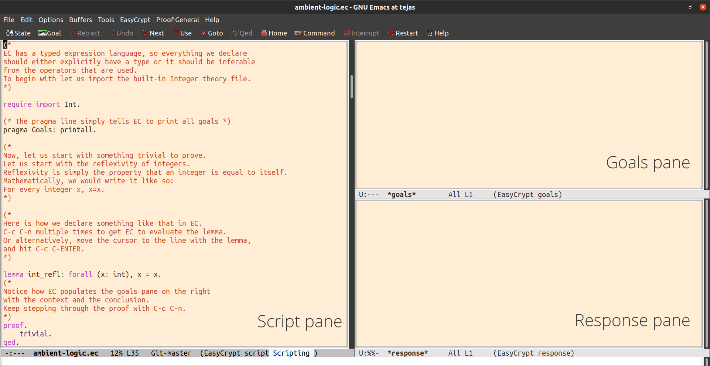

The ambient logic of EasyCrypt is what drives all proof scripts. To get
a grasp of how to work with ambient logic, we will work through the
``ambient-logic.ec`` file. As we saw in the motivating example earlier,
formal proofs are a sequence of proof tactics, and so far, we’ve only
seen the ``admit`` tactic. In this chapter, we will learn some more
basic tactics and work with simple mathematical properties of integers.

It is highly recommended to work through `the
file </docs/tutorials/introduction-itp-program-logics/ambient-logic.ec>`__
using EasyCrypt in the Proof General + Emacs environment. However,
simply reading through this chapter will also provide you with a working
knowledge of ambient logic and the tactics that we use in this chapter.

Navigation
----------

As noted earlier, the official Emacs tutorial covers the basics of
working with Emacs. The tutorial is presented as an option on the splash
screen on fresh installs of Emacs. It can also be accessed by starting
Emacs and then pressing (Ctrl + h), followed by t.

All the keybindings begin either with Ctrl key, denoted by “C”, or the
META or Alt key, denoted by “M”.

So, “C-c C-n” simply means: Ctrl + c and then Ctrl + n.

Apart from all the basic keybindings of Emacs, we have a few more
bindings that are used specifically for interactive theorem proving in
EasyCrypt. We list some of the most common commands here:

+----+--------------+--------------------------------------------------+
| #  | Keystroke    | Command                                          |
+====+==============+==================================================+
| 1. | C-c C-n      | Evaluate next line or block of code              |
+----+--------------+--------------------------------------------------+
| 2. | C-c C-u      | Go back one line or block of code                |
+----+--------------+--------------------------------------------------+
| 3. | C-c C-ENTER  | Evaluate until the cursor position               |
+----+--------------+--------------------------------------------------+
| 4. | C-c C-l      | To reset the Proof-General layout                |
+----+--------------+--------------------------------------------------+
| 5. | C-c C-r      | Begin evaluating from the start (Reset)          |
+----+--------------+--------------------------------------------------+
| 6. | C-c C-b      | Evaluate until the end of the file               |
+----+--------------+--------------------------------------------------+
| 7. | C-x C-s      | Save file                                        |
+----+--------------+--------------------------------------------------+
| 8. | C-x C-c      | Exit Emacs (Pay attention to the prompts)        |
+----+--------------+--------------------------------------------------+

Most formal proofs are written interactively, and the proof-assistant,
EasyCrypt in our case, will keep track of the goals (context and
conclusions) for us. The front-end, Proof-General + Emacs in our case,
will show us the goals and messages from the assistant in the goals pane
and response pane, respectively. Our objective is to use different
tactics to prove or “discharge” the goal.

   The different panes in EasyCrypt

Basic tactics and theorem proving
---------------------------------

EasyCrypt has a typed expression language, so everything we declare
should either explicitly have a type or be inferable from the context.
As we saw earlier, EasyCrypt comes with basic built-in data types. These
can be accessed by importing them into the current environment. In this
file, we will be working with the ``Int`` theory file, and we also want
EasyCrypt to print out all the goals. For this, we provide a directive
to EasyCrypt using a ``pragma``.

::

   require import Int.
   pragma Goals: printall.

Generally, the first steps in our files will be importing theories and
setting the pragma.

Before we dive into cryptography, we need to understand how to direct
EasyCrypt to modify the goals and make progress. As we mentioned, this
is achieved by using tactics. In general, the proofs for lemmas take the
following form:

::

   lemma name ... : ... .
   proof.
   tactic_1.
   ...
   tactic_n.
   qed.

Tactic: ``trivial``
~~~~~~~~~~~~~~~~~~~

To begin with, we will look at a few properties of integers and
introduce how some of the tactics work.

Reflexivity is simply the property that an integer is equal to itself.
Mathematically, we would write it like so:

.. math:: \forall x \in \mathbb{Z}, x=x

We can express this in EasyCrypt with a lemma and prove it like so:

::

   lemma int_refl: forall (x: int), x = x.
   proof.
   trivial.
   qed.

Once we state our lemma and evaluate it, EasyCrypt populates the goal
pane with what needs to be proved. In our case, it presents the
following in the goal.

::

   Current goal

   Type variables: <none>
   ------------------------------------------
   forall (x : int), x = x

We start the proof script with the ``proof``, and then EasyCrypt expects
tactics to close the goal. In this case, we use ``trivial``, to prove
our ``int_refl`` lemma. Upon evaluating ``trivial``, the goal pane is
cleared since using this tactic closes the goal. Once there are no more
goals, we can end the proof with ``qed``, and EasyCrypt saves the lemma
for further use and sends us this message in the response pane. Like so:

::

   + added lemma: `int_refl'

``trivial`` tries to solve the goal using various tactics. So it can be
hard to understand when to apply it, but the good news is that
``trivial`` never fails. It either solves the goals or leaves the goal
unchanged. So you can always try it without harm.

Tactic: ``apply``
~~~~~~~~~~~~~~~~~

Now EasyCrypt knows the lemma ``int_refl`` and allows us to use it to
prove other lemmas. This can be done using the ``apply`` tactic. For
instance:

::

   lemma forty_two_equal: 42 = 42.
   proof.
   apply int_refl.
   qed.

``apply`` tries to match the conclusion of what we are applying (the
proof term) with the goal’s conclusion. If there is a match, it replaces
the goal with the subgoals of the proof term.

In our case, EasyCrypt matches ``int_refl`` to the goal’s conclusion,
sees that it matches, and replaces the goal with what needs to be proven
for ``int_refl``, which is nothing, and it concludes the proof.

EasyCrypt comes with many predefined lemmas and axioms that we can use.
For instance, it has axioms related to commutativity and associativity
for integers. They are by the names ``addzC``, and ``addzA``.

We can ask EasyCrypt to print using: ``print addzC.``

EasyCrypt responds with:
``axiom nosmt addzC: forall (x y : int), x + y = y + x.``

Tactic: ``simplify``
~~~~~~~~~~~~~~~~~~~~

In the proofs, sometimes tactics yield something that can be simplified.
We use the tactic ``simplify`` to carry out the simplification.
``simplify`` reduces the goal to a normal form using lambda calculus. We
don’t need to worry about the specifics of how, but it is important to
understand that EasyCrypt can simplify the goals given it knows how to.
It will leave the goal unchanged if the goal is already in a normal
form.

For instance, here is an example that illustrates the idea.

::

   lemma x_plus_comm (x: int): x + 2*3 = 6 + x.
   proof.
   simplify.
   (* Simplifies the goal to x + 6 = 6 + x.  *)

   simplify.
   trivial.
   (* These make no progress, but don't fail either. *)

   apply addzC.
   (* Discharges the goal *)
   qed.

Tactics: ``move``, ``rewrite``, ``assumption``
~~~~~~~~~~~~~~~~~~~~~~~~~~~~~~~~~~~~~~~~~~~~~~

So far, we saw lemmas without any assumptions except for specifying the
type of a variable. More often than not, we will have assumptions
regarding variables. We need to treat these assumptions as a given and
introduce them into the context. This is done by using ``move =>``
followed by the name you want to give the assumption. Additionally, when
these assumptions show up as goals, instead of applying the assumptions,
we can call the tactic ``assumption`` to discharge the goal directly.
EasyCrypt will automatically look for assumptions that match the goal
when we use ``assumption``.

In the following example, we use ``addz_gt0``, which is this result:

``axiom nosmt addz_gt0: forall (x y : int), 0 < x => 0 < y => 0 < x + y.``

::

   lemma x_pos (x: int): 0 < x => 0 < x+1.
   proof.
   move => x_ge0.
   (*
   Moves the assumption 0 < x into the
   context, and names it x_ge0.
   *)

   rewrite addz_gt0.
   (* Splits into two goals. *)

     (* Goal 1: 0 < x *)
     assumption.

     (* Goal 2: 0 < 1 *)
     trivial.
   qed.

The tactics ``rewrite`` and ``apply`` are very similar, they try to
pattern match the goal with the term that is supplied to them. However,
there can be some subtle differences which aren’t exactly clear. For
instance, with the simple example:

::

   lemma forty_two_equal: 42 = 42.
   proof.
   apply int_refl.
   qed.

``apply int_refl.`` discharges the goal, but ``rewrite int_refl.``
doesn’t make any progress. So sometimes, trial and error are required to
make progress.

We might have a lemma or an axiom that we can rewrite to the goal, but
the LHS and RHS might be flipped, and EasyCrypt will complain that they
don’t match to apply them. To rewrite a lemma or axiom in reverse, we
simply add the “-” in front of the lemma to switch the sides like so:

::

   lemma int_assoc_rev (x y z: int): x + y + z = x + (y + z).
   proof.
   rewrite -addzA.
   trivial.
   qed.

These tactics form the basics of theorem proving and working with
EasyCrypt at the level of ambient logic.

A point to note here is that there are many more options and intricacies
even within these simple tactics. For instance, there are many
introduction patterns with the ``move =>`` tactic, and the keyword
``move`` can be replaced by other tactics as well. Presenting these
introduction patterns with good examples could be an important addition
to this chapter on the basic tactics.

Commands: ``search`` and ``print``
~~~~~~~~~~~~~~~~~~~~~~~~~~~~~~~~~~

Often when it comes to working with theorems, we need the ability to
search through results that are already in the environment. We saw a few
examples of printing in the content that we have covered so far. Let us
take a slightly more detailed look at this part of EasyCrypt that we use
from time to time.

The ``print`` command prints out the request in the response pane. We
can print types, modules, operations, lemmas etc., using the print
keyword. Here are some examples:

::

   print op (+).
   (* Response: abbrev (+)  :
   int -> int -> int = CoreInt.add. *)
   print op min.
   (* Response: op min (a b : int) : int
       = if a < b then a else b. *)
   print axiom Int.fold0.
   (* Response: lemma fold0 ['a]:
       forall (f : 'a -> 'a) (a : 'a), fold f a 0 = a. *)

The keywords simply act as qualifiers and filters. You can print even
without those. The qualifiers simply help us to narrow the results.

The ``search`` command allows us to search for axioms and lemmas
involving a list of operators. It accepts arguments enclosed in the
following braces: 1. ``[ ]`` - Square brackets for unary operators 2.
``( )`` - Rounded brackets for binary operators 3. Combination of these
separated by a space

::

   search [-].
   search (+).
   (* Shows lemmas and axioms that
   include the specified operators. *)
   search ( * ).
   (* Notice the extra space for the "*" operator.
   We need that since (* *) also indicates comments. *)

   search (+) (=) (=>).
   (* Shows lemmas and axioms which have
   all the listed operators *)

In the file, we have peppered some exercises that require the reader to
search for specific results to make progress.

External SMT solvers: ``smt``
~~~~~~~~~~~~~~~~~~~~~~~~~~~~~

An important point to understand is that EC was built to work with
cryptographic properties and more complex things. So although general
mathematical theorems and claims can be proven in EC, it will be quite
painful to do so. We will employ powerful automated tools to take care
of some of these low-level tactics and logic. EC offers this in the form
of the ``smt`` tactic. When we run ``smt``, EC sends the conclusion and
the context to external smt solvers like ``Z3``, ``Alt-Ergo`` etc., that
have been configured to be used by EasyCrypt. If they can solve the
goal, then ``smt`` will discharge the specific sub-goal that it was
invoked on. If not, ``smt`` fails, and the burden of the proof is still
on us.

For example, if we wish to prove the result:

.. math::  \forall x \in \mathbb{R}, \forall a, b \in \mathbb{Z}, \text{ and } x \neq 0 \implies x^a * x^b = x^{a+b} 

We would do it like so:

::

   lemma exp_product (x: real) (a b: int):
        x <> 0%r
     => x^a * x^b = x^(a + b).
   proof.
   move => x_pos.
   rewrite -RField.exprD.
   assumption.
   trivial.
   qed.

However, it can be simplified to:

::

   lemma exp_product_smt (x: real) (a b: int):
   x <> 0%r
   => x^a * x^b = x^(a + b).
   proof.
   smt().
   qed.

The key takeaway is that we will rely on external solvers to do a fair
amount of heavy lifting when it comes to results related to low-level
math.

That concludes this chapter on ambient logic. In this chapter we covered
the basic tactics like ``apply``, ``simplify``, ``move``, ``rewrite``
etc, we also saw how to use the ``search`` and ``print`` commands and
learnt to work with external solvers. We have also provided exercises
that help the reader practice using these tactics. We will introduce
more tactics and other techniques as we progress in the subsequent
chapters.
