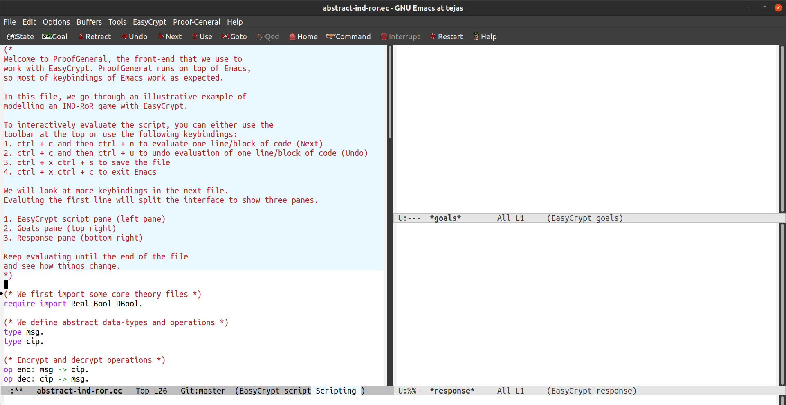

As we saw earlier, the security properties of cryptosystems can be
modelled as games being played by challengers (Alice, Bob) and
adversaries (Eve). EasyCrypt is a proof assistant that allows us to
model and verify these game-based cryptographic proofs.

EasyCrypt environment
---------------------

EasyCrypt is written in OCaml and uses many external tools and
libraries. However, the components that we will be interacting with the
most are the following: 1. **Emacs and Proof General**: Emacs is an
open-source text editor, and Proof General is a generic interface for
proof assistants based on Emacs. Together these form the front-end for
working with EasyCrypt. When working with EasyCrypt, we generally prove
statements interactively using the Emacs + Proof General environment.

::

   *Note*: EasyCrypt also has a batch processing mode which doesn't need the
   Emacs + Proof General front-end and only requires a terminal. However, this
   mode is used to check multiple files and not to write proofs.

2. **External Provers and Why3**: Often called SMT (Satisfiability
   Modulo Theory) provers or SMT solvers are powerful tools that try to
   solve the problem of satisfiability of a formula given a set of
   conditions. With EasyCrypt, there is a possibility to use multiple
   external provers like `Alt-Ergo <https://alt-ergo.ocamlpro.com/>`__,
   `Z3 <https://github.com/Z3Prover/z3>`__ and
   `CVC4 <https://cvc4.github.io/>`__, and
   `Why3 <https://why3.lri.fr/>`__ is used as the platform for all the
   provers.

   These provers can take care of a lot of the low-level and often
   gruelling work of proving some mathematical results, as we will see.

.. note::

   Since there are a lot of external dependencies setting up the
   environment can be quite time-consuming, and doing it right might
   involve quite a bit of choice. If you don’t want to have to make
   choices, we offer an opinionated `installation
   guide </docs/guides/setting-up-easycrypt>`__.

Now without delving too much into the theory, let us start with a quick
motivating example.

Abstract example: IND-RoR game
------------------------------

Let us model a game to prove that a cryptographic protocol possesses the
property of ciphertexts being indistinguishable from random. It is often
abbreviated as IND-RoR (Indistinguishability - Real or Random). The
notion of indistinguishability is considered to be one of the most basic
security assurances that are expected from cryptosystems.

Intuitively, the idea is that if an adversary cannot tell apart an
encrypted message from encrypted randomness, then they can’t obtain any
information from intercepted ciphertexts that they wouldn’t be able to
obtain purely by chance. Hence, the system can be thought to be secure.

To model it mathematically, let us assume we have a cryptographic
protocol, :math:`CP`, that consists of an encryption function,
:math:`Enc`, and a decryption function, :math:`Dec`, known to the
challengers. The adversary gets access to the output of :math:`Enc`. In
this simplified example, we don’t worry about the specifics of these
functions.

So the game for IND-RoR under the protocol, :math:`CP`, would proceed as
follows: 1. Pick :math:`b \in \{0,1\}`, uniformly at random. 2. If
:math:`b = 0`, the challengers encrypt a real message using :math:`Enc`.
Let us call it :math:`c_0 = Enc(m_{\textit{real}})` 3. If :math:`b = 1`,
the challengers encrypt a random bitstring using :math:`Enc`. Let us
call it :math:`c_1 = Enc(m_{\textit{random}})` 4. If :math:`b=0`, send
:math:`c_0` to the adversary, else send :math:`c_1` 5. Adversary is
allowed to perform its computations on the provided ciphertext and is
expected to output :math:`b_{\textit{adv}}` 6. Now, the adversary is
said to win the game if they have a non-negligible advantage in
correctly guessing which ciphertext (real or random) they were supplied
with. Mathematically, the adversary wins the game if:

.. math::

   \mathbb{P}[b_{adv}==b]
   = \dfrac{1}{2} + \epsilon, \text{ where } \epsilon \text{ is non-negligible}

Now, if we come up with a proof that
:math:`P[b_{adv}==b] = \frac{1}{2} + \epsilon`, where :math:`\epsilon`
is negligible, regardless of what the adversary does, then we can claim
that the protocol is secure under the IND-RoR paradigm.

Most cryptographic protocols rely on game-based proofs like these to
prove the protocol’s security properties. Our game, although simplified
to a large extent, can already be modelled in EasyCrypt.

Modelling the IND-RoR game with EasyCrypt
-----------------------------------------

Let us develop an EasyCrypt `proof
sketch </docs/tutorials/introduction-itp-program-logics/abstract-ind-ror.ec>`__
for the game that we defined above.

Every EasyCrypt proof consists of the following major steps:

Defining the objects
~~~~~~~~~~~~~~~~~~~~

We first need to establish the context we would like to work in.
EasyCrypt comes with several predefined types, operators and functions,
such as integers, real numbers, etc. Hence we begin by loading
(``require``) and importing (``import``) the theories into the current
environment (files that contain these definitions are called theory
files or just theories) that we need.

In this example, we will only need the ``Real Bool DBool`` theory files.
``Real`` and ``Bool`` are needed to work with real and boolean types,
and we need the ``DBool`` (boolean distribution) to pick a boolean value
at random. Importing these theories works like so:

::

   require import Real Bool DBool.

Notice how the statement ends with a “.”; this is how statements are
terminated in EasyCrypt.

In addition to the built-in types, we might need custom data types and
operations. EasyCrypt allows us to do so using the keywords ``type`` and
``op``.

Let us define a ``msg`` type for messages, and ``cip`` type for
ciphertexts. Then let us define the operation ``enc: msg -> cip`` which
defines a function called ``enc`` mapping ``msg`` to ``cip``, and a
function called ``dec`` to go back from ``cip`` to ``msg``.
Additionally, let us also define a function called ``comp`` to model the
adversary performing some computation upon receiving a ``cip`` and
returning a ``bool``.

::

   type msg.
   type cip.

   (* Encrypt and decrypt operations. *)
   op enc: msg -> cip.
   op dec: cip -> msg.

   (* Compute operations for the adversary. *)
   op comp: cip -> bool.

Note that these are only abstract definitions, and we haven’t specified
the details of these types or functions. The interesting thing about
EasyCrypt is that we can already go pretty far with the abstract types
and operations.

Let us keep going and define custom module types and modules. Module
types can be thought of as blueprints, while modules can be thought of
as concrete instances of module types. For those familiar with
object-oriented programming, this is similar to interfaces for classes
and the classes that implement those interfaces.

In our example, the challengers have the ability to encrypt and decrypt
messages. We can model this by creating a module type called
``Challenger``, which needs to have two procedures called ``encrypt``
and ``decrypt``. As we said, a module type is simply a blueprint. To
work with the module types, we could create a concrete instance of the
``Challenger`` type and fill out the procedures. In our example, we
create a module, ``C``, of type ``Challenger``. ``C`` has to implement
the procedures ``encrypt`` and ``decrypt``. This can be achieved like
so.

::

   module type Challenger = {
     proc encrypt(m:msg): cip
     proc decrypt(c:cip): msg
   }.

   module C:Challenger = {
     proc encrypt(m:msg): cip = {
       return enc(m);
     }
     proc decrypt(c:cip): msg = {
       return dec(c);
     }
   }.

   (* Similarly, we define an adversary *)
   module type Adversary = {
     proc guess(c:cip): bool
   }.
   (* and a concrete instance of an adversary *)
   module Adv:Adversary = {
     proc guess(c:cip): bool = {
       return comp(c);
     }
   }.

.. note::

   Module types and modules need to begin with a capital letter.

We now have all the ingredients required to model the IND-RoR game
outlined above. A game can be defined as a module in EasyCrypt like so:

::

   module Game(C:Challenger, Adv:Adversary) = {
     proc ind_ror(): bool = {
       var m:msg;
       var c:cip;
       var b,b_adv:bool;
       b <$ {0,1}; (* Sample b uniformly at random *)
       if(b){
         (* Set m to be an authentic message *)
       } else {
         (* Set m to be a random string *)
       }
       c <@ C.encrypt(m);
       b_adv <@ Adv.guess(c);
       return (b_adv = b);
     }
   }.

Here, we leave the ``if`` and ``else`` blocks empty since we don’t want
to introduce too much complexity in this motivating example.

Making claims
~~~~~~~~~~~~~

Once we have the objects defined, we can make claims related to these
objects. We can either state these claims as axioms with the ``axiom``
keyword, in which case EasyCrypt will not expect a proof or a lemma with
the ``lemma`` keyword, and EasyCrypt will expect a proof for the
statement. For our running example, a claim that we can state is that
the probability of ``(b_adv=b)`` or the result, ``res``, holding is
certainly less than or equal to 1. This statement about the probability
of an event is universally true. Hence we can state it as an axiom like
so:

``{Stating an axiom}{list:axiom} axiom ind_ror_pr_le1: phoare [Game(C,Adv).ind_ror: true ==> res] <= 1%r.``

This code can be read in the following way: We state the axiom,
``ind_ror_pr_le1``, which says that the probability (``phoare``) of the
result (``res``) holding upon running the ``ind_ror`` game with ``C``
and ``Adv`` is less than or equal to 1. (The trailing ``\%r`` after
``1`` is how we cast an integer to a real number.)

We will look at the components in more detail as we go along. However,
the key takeaway here is that axioms don’t require proofs.

Next, let us claim that the cryptosystem is indeed IND-RoR secure.
Statements like these are what we intend to prove and are the main
reason we go through the whole setup.

.. note::

   We skip the detail about the negligible advantage and
   :math:`\epsilon` since this is only an illustrative example. We’d pay
   more attention to the details when we work with an actual protocol.

::

   lemma ind_ror_secure:
   phoare [Game(C,Adv).ind_ror: true ==> res]<=(1%r/2%r).

Proofs
~~~~~~

Once we state a lemma, EasyCrypt expects a proof for the same. It is
good practice to start a proof script with the ``proof`` keyword, but it
is not strictly necessary. A proof script is a sequence of tactics that
transform the goal into zero or more sub-goals. A proof is said to be
complete or discharged once we get to zero sub-goals. Upon completing a
proof, we end the script with ``qed``, and EasyCrypt adds the lemma to
the environment.

Since we haven’t filled out the details in our running example, we can’t
really make progress with the proof of ``lemma ind_ror_secure``, so for
this example, we will ``admit`` it. Admitting a result is akin to
axiomatizing it. Ideally, we wouldn’t want to axiomatize a lemma.
However, we use this example to illustrate the structure of EasyCrypt
proofs in general.

::

   lemma ind_ror_secure:
   phoare [Game(C,Adv).ind_ror: true ==> res]<=(1%r/2%r).
   proof.
       admit.
   qed.

The complete code of the example can be found in ``abstract-ind-ror.ec``
file. Most proof scripts are developed interactively. To get a taste of
how this works, you can open ``abstract-ind-ror.ec`` in Emacs. This
should happen automatically if you open any ``.ec`` file. Once you open
the file, you can step through the proof line by line using the
following keystrokes.

1. Ctrl + c and then Ctrl + n to evaluate one line/block of code
2. Ctrl + c and then Ctrl + u to go back one line/block of code
3. Ctrl + x Ctrl + s to save the file
4. Ctrl + x Ctrl + c to exit Emacs.\*

.. note::

   Emacs will prompt you to save the file if you modified it and remind
   you that there is an active easycrypt process running. So please pay
   attention to the prompts. You need to respond with a “yes” to the
   prompt about killing the easycrypt process to exit Emacs.

These four keybindings should be enough to get you through this file. We
will return to more navigation and other important keybindings in the
next chapter. We include these instructions in the file as well, so you
don’t have to keep switching back and forth. Upon evaluating the first
instructions, the screen should look like so:

   Working with ``abstract-ind-ror.ec``

We will develop the concepts required to work with it in the following
chapters. However, we encourage you to get started working with the tool
and try it out right away.

Different logics in EasyCrypt
-----------------------------

Now that we understand that overarching structure of what we can achieve
with EasyCrypt let us get down to the details.

EasyCrypt allows us to work with mathematical objects and results of
different types. To work with these different results, EasyCrypt has the
following logics:

1. **Ambient logic**: This is the higher-order logic that allows us to
   reason with the proof objects and terms.
2. **Hoare logic and its variants**:

   1. **Hoare Logic (HL)**: Allows us to reason about a set of
      instructions or a single program.
   2. **Relational Hoare Logic (RHL)**: Allows us to reason about a pair
      of programs.
   3. **Probabilistic Hoare Logic (pHL)**: When we have a program with
      elements of probabilistic behaviour, we need to modify Hoare Logic
      to work with the elements of probability. EasyCrypt supports
      working with these kinds of programs as well.
   4. **Probabilistic Relational Hoare Logic (pRHL)**: Similarly, pRHL
      allows us to reason with pairs of programs with probabilistic
      behaviour.

With these logics, EasyCrypt allows us to verify the security properties
of cryptographic protocols. Most cryptographic proofs are game-based,
implying that we need the ability to work with pairs of programs, as we
saw earlier in the IND-RoR example. This is essentially why we need RHL
and pRHL.

Apart from these logics, EasyCrypt relies on external SMT solvers to
provide a fair degree of automation. SMT solvers are tools that help to
determine whether a mathematical formula is satisfiable or not. We will
learn to work with these logics and also how to use the external solvers
in the following chapters.
